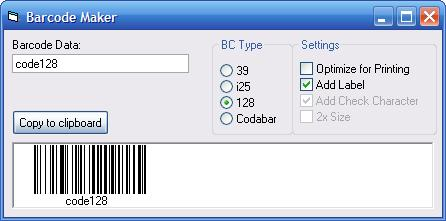



## Barcode Maker 39, i25, 128 &amp; codabar

### Description

This is my little barcode maker for 3 of 9, interleaved 2 of 5, code 128, &amp; codabar. All done with code, no special fonts required. (update: fixed issues with i25 &amp; codabar)
 
### More Info
 

             |
---                |---
**Submitted On**   |2005-12-25 21:40:36
**By**             |[Paul Bahlawan](https://github.com/Planet-Source-Code/PSCIndex/blob/master/ByAuthor/paul-bahlawan.md)
**Level**          |Beginner
**User Rating**    |4.8 (38 globes from 8 users)
**Compatibility**  |VB 5\.0, VB 6\.0
**Category**       |[Miscellaneous](https://github.com/Planet-Source-Code/PSCIndex/blob/master/ByCategory/miscellaneous__1-1.md)
**World**          |[Visual Basic](https://github.com/Planet-Source-Code/PSCIndex/blob/master/ByWorld/visual-basic.md)
**Archive File**   |[Barcode\_Ma19598012252005\.zip](https://github.com/Planet-Source-Code/paul-bahlawan-barcode-maker-39-i25-128-amp-codabar__1-63783/archive/master.zip)

